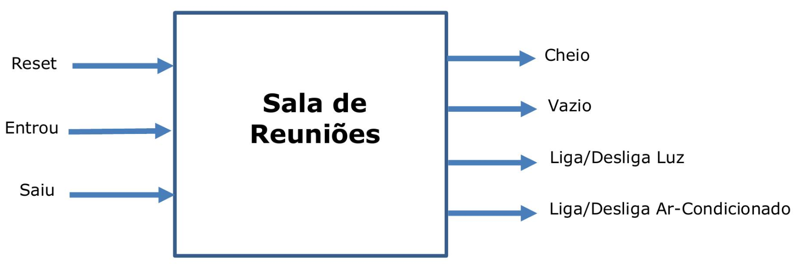

# Controle de Sala de Reunioes em VHDL - v2021

> Disciplina: EPUSP — PCS 3335 — Laboratório Digital A  
> Projeto Livre (versão 2021)

## INTRODUÇÃO

Esta experiência tem como principal objetivo desenvolver um circuito de um controle de sala de reuniões.

## OBJETIVO

Ao fim desta experiência, os seguintes tópicos devem ser conhecidos:

- Conceito e funcionamento de um processo de automação de salas de trabalho em geral.

## 1. PARTE EXPERIMENTAL

Os circuitos digitais podem realizar uma série de controles das atividades do dia-a-dia, seja no lar ou no
trabalho. Uma das atividades do trabalho é realizar reuniões em salas adequadas com mesa, cadeira, boa
iluminação, aparelho de ar-condicionado, dispositivos de apresentação, computadores, aparelhos de viva
voz, etc. Uma sala de reuniões tem uma capacidade máxima de participantes. Quando chega um
participante, a luz deve ser ligada e quando o número de pessoas atinge um valor pré-definido, o aparelho de ar-condicionado deve ser ligado. O aparelho de ar-condicionado deve ser desligado quando o número de participantes fica abaixo de outro valor pré-definido. A luz deve ser desligada quando o
número de participantes atinge zero.

## 1.1. Projeto do Circuito Digital

Um diagrama de blocos de alto nível do circuito de Controle de Sala de Reuniões é ilustrado na Figura 1, com entradas e saídas do circuito.

O sinal do tipo pulso **Reset** gera o estado inicial do circuito e os sinais de saída (**Cheio**, **Vazio**, **Liga/Desliga Luz** e **Liga/Desliga Ar-Condicionado**) estão apagados. Os sinais de tipo pulso **Entrou** e **Saiu** correspondem a uma entrada e uma saída de um participante da sala, respectivamente. Os sinais
de tipo chave **Cheio (“1”)** indica que a sala atingiu sua capacidade máxima e **Vazio (“1”)** indica que todos os participantes saíram da sala. Os sinais de tipo chave **Liga (“1”)/Desliga (“0”) Luz** e **Liga (“1”)/Desliga (“0”) Ar-Condicionado** atuam nos dispositivos de iluminação e ar-condicionado da sala,
respectivamente.

Para este circuito, considera-se que a capacidade máxima da sala é de **15 participantes** e, que o aparelho de ar-condicionado deve ser ligado quando houver pelo menos **10 participantes** e deve ser desligado quando houver menos do que **10 participantes**. Para a luz ser ligada, pelo menos 1 participante precisa entrar na sala e a luz deve ser desligada quando **todos os participantes** saírem da sala.

**Figura 1 – Diagrama de blocos geral do circuito de controle de sala de reuniões.**

## Itens desenvolvidos neste projeto

- Elaboração de um Diagrama de Blocos do circuito com Fluxo de Dados (FD) e Unidade de Controle (UC).
- Elaboração um Diagrama Lógico do FD e simulação de seu funcionamento no [Digital](https://github.com/hneemann/Digital).
- Elaboração de um Diagrama de Estados da UC (Máquina de Moore) em VHDL e simulação do seu
funcionamento no Intel Quartus Prime.
- Integração Fluxo de Dados (FD) com a Unidade de Controle (UC) no Quartus e simulação do seu funcionamento.
- Elaboração de um conjunto de Testes e Depuração do circuito completo.
- Tabela de designação de pinos do circuito completo para a placa FPGA DE0-CV com Cyclone
V 5CEBA4F23C7N.

_OBS: Utilizaremos as entradas em pinos da interface GPIO disponíveis. Usaremos o aplicativo [Waveforms](https://store.digilentinc.com/digilent-waveforms/) do dispositivo Analog Discovery para acionar as entradas da placa FPGA._

## 1.2. Implementação do Sistema Digital

- Programação do circuito na placa FPGA DE0-CV.
- Realize os testes conforme definidos no Planejamento e anote os resultados.

## 2. BIBLIOGRAFIA

- Apostilas do Laboratório de Sistemas Digitais A, 2021.
- Texas Instruments. TTL Logic Data Book, 1994.
- WAKERLY, John F. Digital Design Principles & Practices. 4th edition, Prentice Hall, 2006.
- MEALY, B.; TAPPERO F. Free Range VHDL. freerangefactory.org. 2016.
- NEEMANN, H. DIGITAL: [github.com/hneemann/Digital](https://github.com/hneemann/Digital) consultado em Abril, 2021.

## 3. MATERIAL DISPONÍVEL

- 74160, 74161, 74162, 74163, 74191, outros circuitos integrados e portas lógicas básicas.

## 5. EQUIPAMENTOS NECESSÁRIOS (*)

- 1 computador com software Intel Quartus Prime
- 1 placa de desenvolvimento FPGA DE0-CV com o dispositivo Cyclone V 5CEBA4F23C7N
- 1 dispositivo Analog Discovery ou outro método para acionar as entradas do circuito

## 6. UTILIZANDO O PROJETO

- Faça o download do arquivo **sala_de_reunioes.QAR** dentro da pasta **assets**
- Abra o arquivo com o Quartus Prime
- Em seguida todos os arquivos .VHD bem como a pinagem da placa são carregados na pasta raíz do projeto
- Caso queira visualizar os arquivos base do projeto como a [Unidade de Controle](https://github.com/kevinkirsten/ControleSalaDeReunioesVHDL/blob/main/vhdl/uc.vhd), o [Fluxo de Dados](https://github.com/kevinkirsten/ControleSalaDeReunioesVHDL/blob/main/vhdl/fd.vhd), a [Sala de Reuniões Completa](https://github.com/kevinkirsten/ControleSalaDeReunioesVHDL/blob/main/vhdl/sala_de_reunioes.vhd), ou os [Displays de 7 segmentos](https://github.com/kevinkirsten/ControleSalaDeReunioesVHDL/blob/main/vhdl/dual_seven_segment_deo_cv.vhd) para o Kit DE0-CV, basta clicar nos itens anteriores ou navegar até a pasta vhdl
- O [Relatório](https://github.com/kevinkirsten/ControleSalaDeReunioesVHDL/blob/main/assets/relatório_sala_de_reunioes.pdf) com o desenvolvimento pode ser encontrado dentro da pasta assets no arquivo relatório_sala_de_reunioes.pdf

## AGRADECIMENTOS E CRÉDITOS

> Projeto desenvolvido em parceria com [Robson Rezende da Silva](https://github.com/robrezen) durante o EAD no 1º Semestre de 2021  
>
>Prof Orientador: [Sérgio Roberto de Mello Canovas](http://buscatextual.cnpq.br/buscatextual/visualizacv.do)  
>
>Desenvolvimento do escopo do projeto. Profs: [Kechi Hirama](https://www2.pcs.usp.br/~kechi/), [Jorge Kinoshita](http://www2.pcs.usp.br/~jkinoshi/), [Glauber de Bona](http://buscatextual.cnpq.br/buscatextual/visualizacv.do;jsessionid=04CACBDF643AC257D30761116C2DA82E.buscatextual_0) – versão 2021
